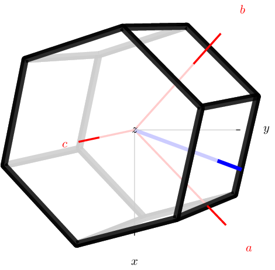

# unitcell
Python script to generate vector graphics of an oriented lattice unit cell

## Examples

```
unitcell --type hexagonal --eulers 12 23 34 --axes --crystalvector 1 0.4823 0 --perspective
```



## Dependencies

* Python 3
* working installation of `sketch_0.3.7tight`
